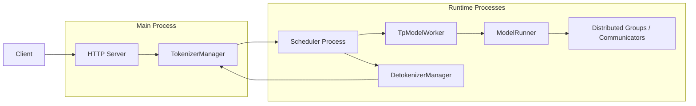
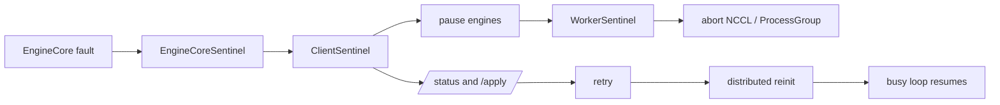
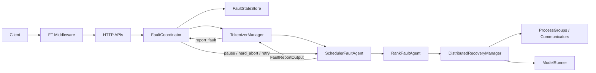
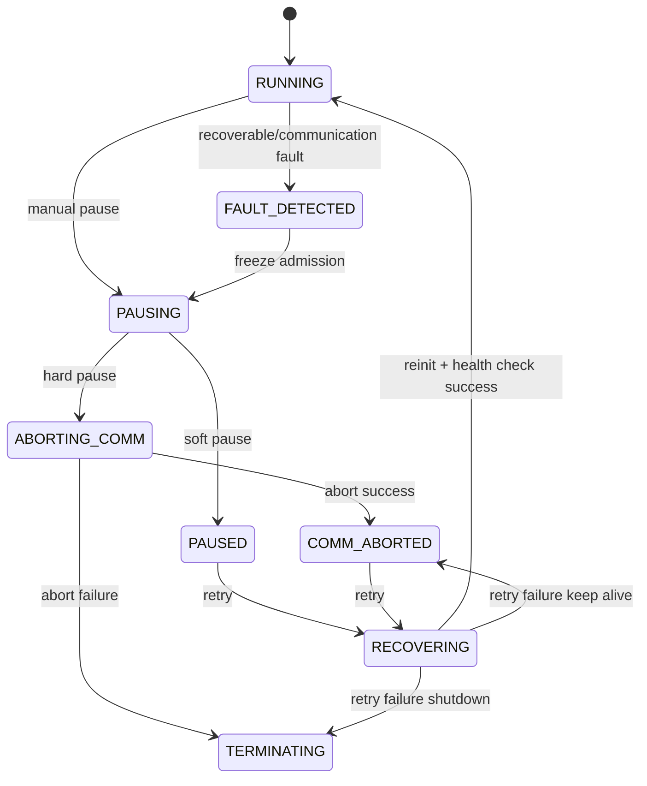
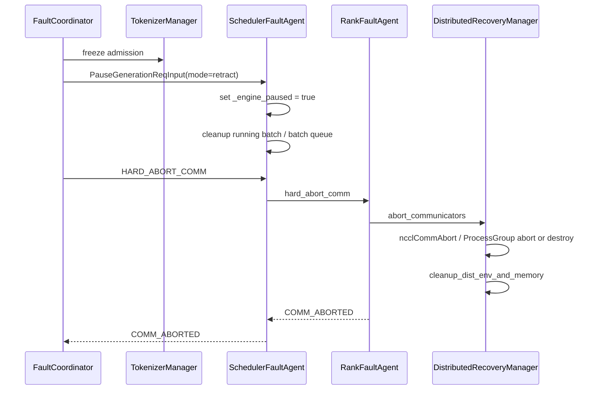
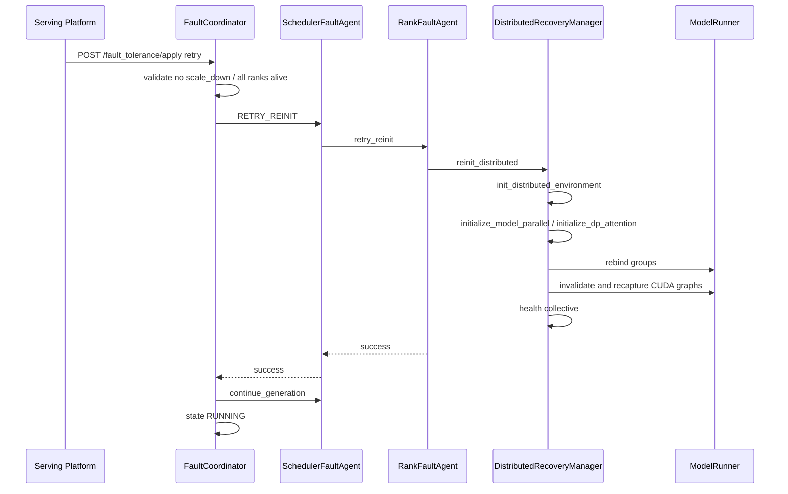

# SGLang Fault-Tolerance M1-M3 Retry-only Presentation 设计文档

## 0. Presentation 目标

这份文档用于汇报 SGLang 直接实现 M1、M2、M3 fault-tolerance 的详细设计。核心主题是：SGLang 本次不只做软故障 resume，而是实现 same-topology retry，包括通信域 abort/reinit；同时明确不支持 scale_down、rank replacement 和 topology-changing recovery。

建议时长：35 到 50 分钟。

## 1. Slide 1：标题

标题：

```text
SGLang Fault-Tolerance M1-M3 Design
Same-topology retry with communication-domain rebuild
```

页面要点：

- 直接交付 M1、M2、M3。
- retry 包含 communicator / ProcessGroup rebuild。
- 不支持 scale_down / rank replacement。

讲稿提示：

> 这版设计的重点是把 retry 做到和 vLLM M1 对齐：不是简单 resume loop，而是故障后停住 runtime、abort 旧通信域，再用相同 topology 重建通信域后恢复。

## 2. Slide 2：设计范围变化

标题：

```text
Scope change: from soft resume to retry with comm reinit
```

对比：

| 旧保守范围 | 新范围 |
| --- | --- |
| 只恢复健康暂停的进程 | 恢复通信域被 abort 后的同 topology runtime |
| 只做 loop resume | 必须重建 communicator / ProcessGroup |
| 主要复用 pause/continue | pause + hard abort + distributed reinit + continue |
| DP/TP 多 rank 不承诺 | 支持 required ranks 全存活的 same-topology retry |
| 后续再做 vLLM M1 能力 | 本次直接做 M1-M3 |

讲稿提示：

> 用户期望不是“先做控制面，后面再说通信域”，而是这次直接把 retry 做完整。限制条件是 topology 不变，所有 required rank 都还活着。

## 3. Slide 3：为什么 retry 必须重建通信域

标题：

```text
Why resume-only retry is unsafe
```

页面要点：

- collective fault 后不同 rank 可能停在不同阶段。
- 旧 NCCL communicator 可能已 timeout 或半失败。
- torch ProcessGroup backend 状态可能不一致。
- CUDA graph 可能捕获了旧 communicator。
- 继续使用旧通信域会导致 hang、错误结果或二次崩溃。

图示：

```text
Rank 0 exits collective     Rank 1 still waiting
        |                           |
        v                           v
old communicator inconsistent / unsafe
        |
        v
must abort + rebuild before retry
```

讲稿提示：

> 这也是 vLLM M1 做 communicator abort/reinit 的原因。collective 被打断后，安全边界不是 scheduler loop，而是通信域。

## 4. Slide 4：当前 SGLang 架构锚点

标题：

```text
Where FT hooks into SGLang
```

Mermaid：



页面要点：

- TokenizerManager：冻结入口。
- Scheduler：暂停 event loop、清理 batch。
- TpModelWorker/ModelRunner：通信域和 CUDA graph 恢复核心。
- Distributed parallel_state：group destroy/reinit 基础。

讲稿提示：

> FT 不能只放在 HTTP 层。M2/M3 必须进入 scheduler 和 ModelRunner，因为通信域、CUDA graph、KV/batch 状态都在那里。

## 5. Slide 5：vLLM M1 参考

标题：

```text
vLLM M1 reference flow
```

Mermaid：



页面要点：

- `ClientSentinel` 聚合状态。
- `EngineCoreSentinel` 控制 engine loop。
- `WorkerSentinel` abort/reinit communicator。
- retry 不是简单 continue。

讲稿提示：

> SGLang 不照搬 vLLM 类结构，但要对齐这个语义闭环。

## 6. Slide 6：SGLang M1-M3 总体架构

标题：

```text
SGLang FT architecture for M1-M3
```

Mermaid：



组件职责：

- `FaultCoordinator`：状态机、API、聚合结果。
- `SchedulerFaultAgent`：捕获 recoverable fault、暂停 scheduler、转发 rank command。
- `RankFaultAgent`：本 rank pause/abort/retry/health check。
- `DistributedRecoveryManager`：abort/reinit/rebind/graph recapture。

讲稿提示：

> 相比旧方案，新增的关键组件是 RankFaultAgent 和 DistributedRecoveryManager。它们让 retry 能处理通信域重建。

## 7. Slide 7：Milestone 定义

标题：

```text
M1, M2, M3 deliverables
```

表格：

| Milestone | 交付内容 |
| --- | --- |
| M1 | status/apply API、middleware、FaultCoordinator、状态机、manual pause/retry/terminate。 |
| M2 | fault report、scheduler pause、rank command、hard abort communicator/process group、unsafe batch cleanup。 |
| M3 | same-topology distributed reinit、group rebind、CUDA graph invalidation/recapture、health check、resume scheduler。 |

讲稿提示：

> 这次不是三阶段规划，而是三块都进入本次实现范围。PR 可以分阶段提交，但最终验收覆盖 M1-M3。

## 8. Slide 8：状态机

标题：

```text
State machine with communication abort
```

Mermaid：



状态要点：

- `COMM_ABORTED` 是 retry 前的关键安全点。
- `RECOVERING` 期间普通请求仍 503。
- retry 成功前不能打开 admission gate。

## 9. Slide 9：M1 控制面

标题：

```text
M1: control plane
```

页面要点：

- `GET /fault_tolerance/status`。
- `POST /fault_tolerance/apply`。
- `FaultCoordinator` 串行化 pause/retry/terminate。
- Middleware 在非 RUNNING 返回 503。
- scale_down 请求直接 unsupported。

API 示例：

```json
{
  "fault_tolerance_instruction": "retry",
  "fault_tolerance_timeout": 60,
  "fault_tolerance_params": {
    "reinit_distributed": true,
    "clear_running_batch": true,
    "recapture_cuda_graph": true
  }
}
```

讲稿提示：

> M1 是对外协议。上层平台只需要知道 status 和 apply，不需要了解 scheduler 或 communicator 细节。

## 10. Slide 10：M2 hard pause

标题：

```text
M2: pause and hard-abort communication domain
```

Mermaid：



页面要点：

- `retract` 是默认 scheduler pause mode。
- hard pause 要 disable + abort communicators。
- abort 成功后才允许 retry。

讲稿提示：

> M2 的产物不是 RUNNING，而是一个可恢复的静止点：请求入口冻结、scheduler 停住、旧通信域已被拆掉。

## 11. Slide 11：M3 retry

标题：

```text
M3: same-topology retry
```

Mermaid：



讲稿提示：

> retry 只允许相同 topology。所有 rank 必须还在，rank id 和 world size 不变；只允许换 rendezvous endpoint 和 communicator 实例。

## 12. Slide 12：Same-topology only

标题：

```text
What retry supports and rejects
```

支持：

- 所有 required rank 仍存活。
- world size 不变。
- rank mapping 不变。
- DP/TP/PP/EP/CP group 划分不变。
- 新端口或新 rendezvous endpoint。
- communicator / ProcessGroup / CUDA graph 重建。

拒绝：

- `scale_down`。
- rank replacement。
- 节点永久丢失。
- DP size 变化。
- expert 迁移。
- 进程死亡后的 in-place retry。

讲稿提示：

> 这是本次最重要的边界。retry 是“同一批 rank 重新建连”，不是“少一个 rank 继续跑”。

## 13. Slide 13：通信域恢复细节

标题：

```text
Communication-domain lifecycle
```

页面要点：

1. Disable communicator，阻止新 collective。
2. Abort PyNccl communicator：新增 `ncclCommAbort` wrapper。
3. Abort 或 destroy torch ProcessGroup backend。
4. Destroy model parallel groups 和 world group。
5. Reinit distributed env。
6. Recreate TP/PP/DP/EP/attention/MoE groups。
7. Rebind model-side group references。
8. Health collective。

讲稿提示：

> SGLang 已经有 destroy_model_parallel、destroy_distributed_environment 和 cleanup_dist_env_and_memory，缺口主要是 abort 能力、group 枚举、ModelRunner rebind 和 graph invalidation。

## 14. Slide 14：CUDA graph 和 batch state

标题：

```text
Graph and batch state cannot be reused blindly
```

页面要点：

- old CUDA graph 可能捕获旧 communicator。
- fault iteration 可能已经部分写 KV。
- streaming 请求可能已输出部分 token。
- running batch / batch queue / chunked req 需要清理或 retract。
- graph 必须 invalidated，恢复后 recapture 或临时禁用。

推荐策略：

```text
auto fault pause = retract + hard abort
retry = clear unsafe batch + reinit + recapture + health check
```

讲稿提示：

> 通信域恢复只是必要条件，不是充分条件。batch、KV 和 CUDA graph 也要回到可信状态。

## 15. Slide 15：故障分类

标题：

```text
Fault classes
```

表格：

| 故障 | 行为 |
| --- | --- |
| `RecoverableFault` | hard pause + retry。 |
| communication timeout 且 rank 响应 | abort comm + retry。 |
| manual hard pause | abort comm，等待 retry。 |
| unknown Python exception | fail-stop。 |
| scheduler/detokenizer 进程退出 | fail-stop。 |
| CUDA context fatal | fail-stop。 |
| rank 永久丢失 | retry 失败；scale_down unsupported。 |
| scale_down 指令 | 400 unsupported。 |

讲稿提示：

> 不要把所有异常都包进 FT。只有进程仍活着、rank 还能响应 command、topology 不变的场景才进入 retry。

## 16. Slide 16：测试计划

标题：

```text
Validation plan
```

测试分层：

1. State/coordinator/middleware 单测。
2. rank agent command 聚合测试。
3. fake communicator abort/reinit mock 测试。
4. TP=2 GPU 集成：fault -> abort -> retry -> all_reduce success。
5. DP>1 same-size retry：新 endpoint reinit。
6. CUDA graph enabled：旧 graph invalidated，retry 后 recapture。
7. rank exit：retry fail，scale_down unsupported。
8. FT disabled 回归。

验收句：

```text
retry success means new communication domain passes health collective and normal inference resumes.
```

## 17. Slide 17：PR 拆分

标题：

```text
Implementation plan
```

表格：

| PR | 内容 |
| --- | --- |
| PR1 | M1 控制面：配置、state、coordinator、API、middleware。 |
| PR2 | M2 command：scheduler fault report、rank agent、command result。 |
| PR3 | M2 abort：PyNccl abort、ProcessGroup abort/destroy、cleanup。 |
| PR4 | M3 reinit：same-topology distributed/model-parallel reinit。 |
| PR5 | M3 safety：batch cleanup、group rebind、CUDA graph recapture。 |
| PR6 | E2E tests、文档、平台对接。 |

讲稿提示：

> 虽然按 PR 拆分，但最终交付范围包含 M1-M3；不是只做 PR1 就算完成。

## 18. Slide 18：风险

标题：

```text
Risks and mitigations
```

风险：

- PyTorch backend abort API 版本差异。
- SGLang PyNccl wrapper 当前缺少 `ncclCommAbort`。
- ModelRunner 内部 group references 分散。
- CUDA graph 捕获通信算子后必须全量 invalidation。
- streaming 输出已经部分返回，不能透明续接。
- MoE/EP/DP 复杂 topology 下 same-topology reinit 需要更多集成测试。

缓解：

- abort 不可用时 fallback destroy。
- retry 前 required rank health check。
- retry 后 collective health check。
- 不能 rebind 的对象直接 fail retry。
- 默认 `shutdown_on_fault_tolerance_failure=True`。

## 19. Slide 19：结论

标题：

```text
Conclusion
```

页面要点：

- 本次 SGLang FT 直接实现 M1-M3。
- retry 包含通信域重建，不是单纯 continue。
- 支持 same-topology retry。
- 不支持 scale_down、rank replacement、world size 变化。
- 成功标准是：fault 后 hard pause，retry 后新通信域通过 health check，推理恢复。

收尾话术：

> 这版设计把 SGLang 的 fault-tolerance 从“可暂停”推进到“可同拓扑恢复”。它不解决节点永久丢失，但能覆盖进程仍存活、通信域需要重建的 retry 场景。

## 20. 附录 A：API 示例

查询状态：

```bash
curl http://127.0.0.1:30000/fault_tolerance/status
```

hard pause：

```bash
curl -X POST http://127.0.0.1:30000/fault_tolerance/apply \
  -H 'Content-Type: application/json' \
  -d '{
    "fault_tolerance_instruction": "pause",
    "fault_tolerance_timeout": 30,
    "fault_tolerance_params": {"mode": "retract", "hard": true}
  }'
```

retry：

```bash
curl -X POST http://127.0.0.1:30000/fault_tolerance/apply \
  -H 'Content-Type: application/json' \
  -d '{
    "fault_tolerance_instruction": "retry",
    "fault_tolerance_timeout": 60,
    "fault_tolerance_params": {
      "reinit_distributed": true,
      "clear_running_batch": true,
      "recapture_cuda_graph": true
    }
  }'
```

scale_down unsupported：

```bash
curl -X POST http://127.0.0.1:30000/fault_tolerance/apply \
  -H 'Content-Type: application/json' \
  -d '{"fault_tolerance_instruction": "scale_down"}'
```

预期返回：

```json
{
  "success": false,
  "error": "scale_down is not supported by SGLang FT retry-only mode"
}
```

## 21. 附录 B：Q&A

### Q1：为什么 M1-M3 必须重建通信域？

collective fault 后旧 communicator 和 process group 可能处于不一致状态，resume loop 不足以保证安全。必须 abort/destroy 后重建。

### Q2：这是否等于支持 scale_down？

不是。retry 要求所有 required rank 仍存活，world size 和 rank mapping 不变。少 rank 继续跑属于 scale_down，本次不支持。

### Q3：能恢复 GPU fatal 吗？

不能。CUDA context fatal、device lost、segfault、进程死亡仍 fail-stop。

### Q4：为什么要处理 CUDA graph？

如果 CUDA graph 捕获了 collective 或 communicator，旧 graph 可能引用已 abort 的 communicator。retry 后必须 invalidate/recapture。

### Q5：和 vLLM 的差别是什么？

语义对齐 vLLM M1：hard pause、abort comm、retry reinit。实现上适配 SGLang：用 `FaultCoordinator`、`SchedulerFaultAgent`、`RankFaultAgent`、`DistributedRecoveryManager`，而不是照搬 vLLM sentinel 类。