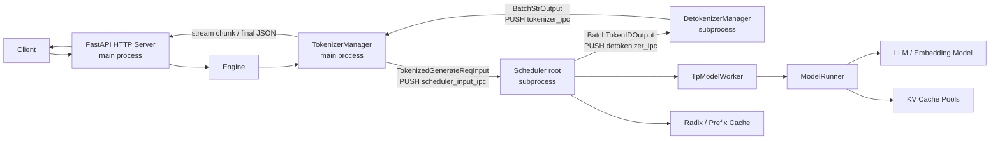
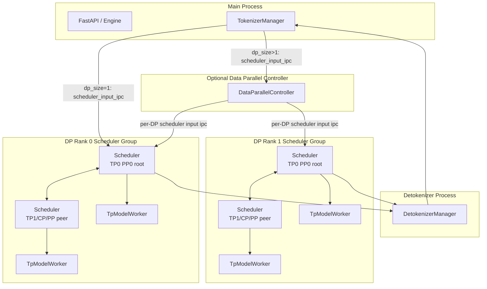
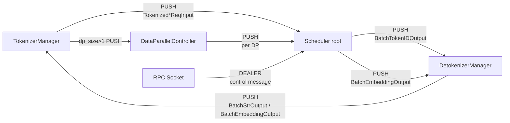
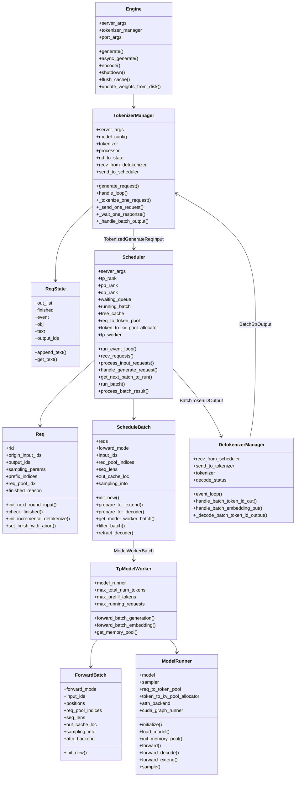
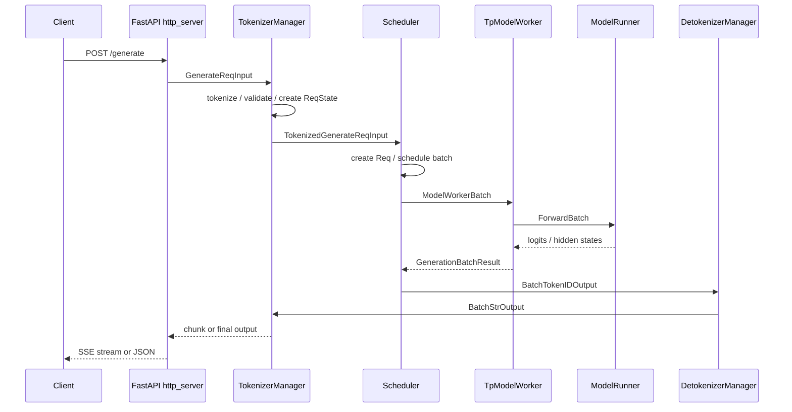
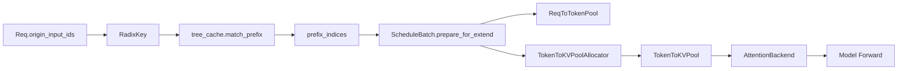

# SGLang 架构总结

本文基于当前本地仓库源码阅读生成，重点覆盖 SGLang Runtime (`python/sglang/srt`) 的服务入口、部署视图、关键类关系、核心组件职责，以及一次推理请求从 API 到模型执行再到返回客户端的完整数据流。

## 1. 总体架构

SGLang 的在线推理服务可以理解为一个由 HTTP/API 层、Tokenizer 层、Scheduler 层、Model Worker 层、Detokenizer 层组成的多进程运行时。主进程负责 API、请求归一化和 tokenizer，子进程负责调度、GPU 执行和 detokenization，各进程之间通过 ZMQ IPC 通信。

核心入口和路径：

| 层级 | 主要源码 | 作用 |
|---|---|---|
| 启动入口 | `python/sglang/launch_server.py` | 解析 `ServerArgs`，选择 HTTP、gRPC、Ray、encoder-only 等启动模式 |
| HTTP 服务 | `python/sglang/srt/entrypoints/http_server.py` | FastAPI 路由，处理 `/generate`、`/encode`、OpenAI/Ollama/Anthropic 兼容接口 |
| 引擎封装 | `python/sglang/srt/entrypoints/engine.py` | 本地 API 封装，拉起 Scheduler/Detokenizer 子进程，创建 `TokenizerManager` |
| Tokenizer 管理 | `python/sglang/srt/managers/tokenizer_manager.py` | 请求校验、tokenize、多模态处理、发送调度请求、聚合输出 |
| 调度器 | `python/sglang/srt/managers/scheduler.py` | 动态批处理、prefix cache、KV cache 分配、prefill/decode 调度 |
| Batch 数据结构 | `python/sglang/srt/managers/schedule_batch.py` | `Req`、`ScheduleBatch`、`ModelWorkerBatch`，连接 Scheduler 和模型执行 |
| GPU Worker | `python/sglang/srt/managers/tp_worker.py` | 将 batch 转为 `ForwardBatch`，调用 `ModelRunner` forward/sample |
| 模型执行 | `python/sglang/srt/model_executor/model_runner.py` | 加载模型、初始化内存池和 attention backend，执行 prefill/decode forward |
| Forward 元信息 | `python/sglang/srt/model_executor/forward_batch_info.py` | `ForwardBatch`，模型 forward 的完整运行时上下文 |
| 解码器 | `python/sglang/srt/managers/detokenizer_manager.py` | 将 token id 增量解码为文本 delta |
| IPC 数据结构 | `python/sglang/srt/managers/io_struct.py` | API 输入、tokenized 输入、batch 输出、控制消息等 dataclass |
| 内存/缓存 | `python/sglang/srt/mem_cache/*` | KV pool、request-token pool、radix/prefix cache、allocator |

## 2. 部署视图

### 2.1 默认 HTTP 部署



默认路径中，`http_server.launch_server` 会调用 `Engine._launch_subprocesses` 创建 Scheduler 子进程、Detokenizer 子进程，并在主进程中创建 `TokenizerManager`。HTTP 请求进入 FastAPI 后，最终都通过 `TokenizerManager.generate_request` 进入运行时。

### 2.2 多 GPU / 多并行维度部署



部署要点：

| 场景 | 行为 |
|---|---|
| `dp_size == 1` | `Engine._launch_scheduler_processes` 直接按 `tp_rank`、`pp_rank`、`attn_cp_rank` 启动 Scheduler 子进程 |
| `dp_size > 1` | 先启动 `DataParallelController`，它接收 Tokenizer 请求后按策略分发给不同 DP worker group |
| TP / CP / PP | Scheduler root 从 IPC 收请求，然后在组内 broadcast 或通过 pipeline 传递 batch |
| 多节点 | `node_rank > 0` 节点只启动 Scheduler/Worker，不启动 Tokenizer/Detokenizer |
| Detokenizer | 统一接收 Scheduler 的 token id 输出，解码后返回主进程 TokenizerManager |
| `skip_tokenizer_init` | Scheduler 可以直接把 token id 输出发回 Tokenizer IPC，绕过普通 detokenization |

### 2.3 进程间 IPC 通道



`TokenizerManager` 在主进程中维护 `rid_to_state`，因此返回路径必须最终回到主进程。Scheduler 不直接面向 HTTP 客户端，而是只输出 batch 级别的 token id 或 embedding 结果。

## 3. 关键类关系



## 4. 核心组件详解

### 4.1 `ServerArgs` 与 `PortArgs`

`ServerArgs` 是运行时配置中心，贯穿启动、Tokenizer、Scheduler、Worker、ModelRunner。它包含模型加载、tokenizer、多模态、并行、内存、调度、speculative decoding、LoRA、disaggregation、观测性等配置。

`PortArgs` 负责生成进程间通信使用的 IPC 名称和端口，包括 tokenizer、scheduler input、detokenizer、RPC，以及 DP 模式下每个 worker group 的输入通道。

协作关系：

| 组件 | 使用方式 |
|---|---|
| `launch_server.py` | 从 CLI 构造 `ServerArgs`，决定启动模式 |
| `Engine` | 根据 `ServerArgs` 和 `PortArgs` 拉起子进程 |
| `TokenizerManager` | 根据 `ServerArgs` 初始化 tokenizer、processor、IPC、LoRA、metrics |
| `Scheduler` | 根据 `ServerArgs` 初始化并行拓扑、调度策略、cache、worker |
| `ModelRunner` | 根据 `ServerArgs` 决定 dtype、内存比例、attention backend、CUDA graph、量化等 |

### 4.2 `Engine`

源码：`python/sglang/srt/entrypoints/engine.py`

`Engine` 是本地程序化调用和 HTTP 服务共用的高层封装。它不直接执行模型，而是负责启动运行时子进程，并把请求交给 `TokenizerManager`。

主要属性：

| 属性 | 含义 |
|---|---|
| `server_args` | 启动和运行配置 |
| `tokenizer_manager` | 主进程请求处理器 |
| `template_manager` | chat template 管理 |
| `_scheduler_init_result` | Scheduler 初始化后的资源限制信息 |
| `port_args` | IPC 通道配置 |
| `send_to_rpc` | 发往 Scheduler 的控制消息通道 |
| `loop` | 后台事件循环 |

关键方法：

| 方法 | 作用 |
|---|---|
| `_launch_subprocesses` | 配置环境，启动 Scheduler、Detokenizer，创建 `TokenizerManager` |
| `_launch_scheduler_processes` | 按 DP/TP/PP/CP 拓扑启动 Scheduler 进程 |
| `generate` / `async_generate` | 创建 `GenerateReqInput`，调用 `TokenizerManager.generate_request` |
| `encode` / `async_encode` | 创建 `EmbeddingReqInput`，走同一套 runtime |
| `shutdown` | 停止子进程和后台循环 |
| `flush_cache`、`abort_request`、`update_weights_*`、`load_lora_adapter` | 通过 RPC 控制 Scheduler/Worker |

### 4.3 `TokenizerManager`

源码：`python/sglang/srt/managers/tokenizer_manager.py`

`TokenizerManager` 是主进程中最关键的状态组件。它负责把 API 层对象转成 Scheduler 能处理的 tokenized 对象，并维护每个 request id 的返回状态。

主要属性：

| 属性 | 含义 |
|---|---|
| `server_args`、`model_config` | 运行配置和模型约束 |
| `tokenizer`、`processor`、`mm_processor` | 文本、多模态、processor 初始化结果 |
| `async_dynamic_batch_tokenizer` | 可选的异步动态 batch tokenizer |
| `recv_from_detokenizer` | 接收 `BatchStrOutput` 或 `BatchEmbeddingOutput` |
| `send_to_scheduler` | 发送 `TokenizedGenerateReqInput` 或 `TokenizedEmbeddingReqInput` |
| `rid_to_state` | `rid -> ReqState`，保存流式/非流式输出状态 |
| `server_status` | 记录请求数、token 数、启动时间等状态 |
| `model_update_lock`、`lora_update_lock` | 权重更新、LoRA 更新期间保护请求路径 |
| `lora_registry` | LoRA 名称、路径、id 映射 |
| `metrics_collector` | 请求级指标 |

关键方法：

| 方法 | 作用 |
|---|---|
| `generate_request` | API 请求入口，归一化 batch，初始化 `ReqState`，tokenize，发送请求并 yield 输出 |
| `_tokenize_one_request` | 处理 text/input_ids/input_embeds/multimodal，生成 token ids 和多模态输入 |
| `_create_tokenized_object` | 创建 `TokenizedGenerateReqInput` 或 `TokenizedEmbeddingReqInput` |
| `_send_one_request` / `_send_batch_request` | 通过 ZMQ 把 tokenized 请求发往 Scheduler |
| `_wait_one_response` | 等待 `ReqState.event`，返回流式 chunk 或最终结果 |
| `handle_loop` | 后台循环，从 Detokenizer 接收 batch 输出 |
| `_handle_batch_output` | 将 batch 输出拆成 per-request 结果，填充 `meta_info` 并唤醒等待协程 |

`ReqState` 是 `TokenizerManager` 内部的请求状态对象：

| 字段 | 含义 |
|---|---|
| `out_list` | Scheduler/Detokenizer 返回但尚未被 API 消费的输出列表 |
| `finished` | 请求是否结束 |
| `event` | 协程等待/唤醒信号 |
| `obj` | 原始 API 请求对象 |
| `text`、`output_ids` | 累计文本和 token id |
| `input_token_logprobs_val`、`output_token_logprobs_val` 等 | logprob 累计状态 |

### 4.4 `Scheduler`

源码：`python/sglang/srt/managers/scheduler.py`

`Scheduler` 是运行时核心。它负责接收 tokenized 请求，执行动态批处理，管理 prefix/KV cache，调用模型 worker，并把 token id 输出推给 Detokenizer。

主要属性：

| 属性 | 含义 |
|---|---|
| `tp_rank`、`pp_rank`、`dp_rank`、`attn_cp_rank` | 当前进程在并行拓扑中的位置 |
| `recv_from_tokenizer`、`recv_from_rpc` | root rank 的请求和控制消息输入 |
| `send_to_tokenizer`、`send_to_detokenizer` | 输出通道 |
| `tp_worker` | 当前 rank 的模型执行 worker |
| `model_worker`、`draft_worker` | 主模型和可选 draft/spec worker |
| `req_to_token_pool` | request slot 到 token slot 的映射池 |
| `token_to_kv_pool_allocator` | KV token slot 分配器 |
| `tree_cache` | radix/prefix cache |
| `waiting_queue` | 等待 prefill 的请求队列 |
| `running_batch` | 正在 decode 的 batch |
| `chunked_req` | chunked prefill 中尚未完成 prefill 的请求 |
| `grammar_manager` | 结构化输出 grammar 调度 |
| `schedule_policy` | 等待队列排序和选择策略 |

关键方法：

| 方法 | 作用 |
|---|---|
| `run_event_loop` | 进入正常或 overlap 调度循环 |
| `recv_requests` | 从 Tokenizer/RPC 收消息，并在 TP/PP/CP rank 间同步 |
| `process_input_requests` | 根据消息类型分发到 generate、embedding、abort、flush、更新权重等处理函数 |
| `handle_generate_request` | 将 `TokenizedGenerateReqInput` 转成内部 `Req` 并入队 |
| `_add_request_to_queue` | 按普通/PD disaggregation 模式放入不同等待队列 |
| `get_next_batch_to_run` | 决定本轮运行 prefill batch、decode batch 或 idle batch |
| `_get_new_batch_prefill_raw` | 选择新 prefill 请求，匹配 prefix cache，分配资源，构造 `ScheduleBatch` |
| `update_running_batch` | 过滤完成请求，检查 decode KV 空间，不足时 retract，准备 decode batch |
| `run_batch` | 调用 `TpModelWorker.forward_batch_generation` 或 embedding forward |
| `process_batch_result` | 处理模型输出，更新请求状态、cache、finish reason，并触发流式输出 |

### 4.5 `Req`

源码：`python/sglang/srt/managers/schedule_batch.py`

`Req` 是 Scheduler 内部 per-request 状态。它已经脱离 API 层，直接服务于调度、cache、KV 分配和输出判断。

主要属性：

| 属性 | 含义 |
|---|---|
| `rid` | request id |
| `origin_input_text`、`origin_input_ids` | 原始输入文本和 token ids |
| `output_ids` | 已生成 token ids |
| `fill_ids` | 当前轮需要进入模型的完整 token 序列 |
| `sampling_params` | 采样参数 |
| `stream` | 是否流式输出 |
| `req_pool_idx` | 在 `ReqToTokenPool` 中的 request slot |
| `prefix_indices` | 命中的 prefix cache token slots |
| `last_node`、`last_host_node` | radix cache 节点 |
| `kv_committed_len`、`kv_allocated_len` | 已提交/已分配 KV 长度 |
| `finished_reason` | 停止原因 |
| `surr_offset`、`read_offset` | 增量 detokenize 边界 |
| `lora_path`、`lora_id` | LoRA 信息 |
| `grammar` | 结构化输出 grammar |

关键方法：

| 方法 | 作用 |
|---|---|
| `init_next_round_input` | 计算当前 prefill 轮输入，匹配 `tree_cache`，设置 prefix 命中信息 |
| `set_extend_input_len` | 设置本轮 extend 长度，支持 chunked prefill |
| `init_incremental_detokenize` | 为 Detokenizer 准备 surrounding/read token id 和 offset |
| `check_finished` | 根据 max token、stop token、stop string、regex、grammar 判断是否结束 |
| `reset_for_retract` | decode 内存不足时回退请求状态 |
| `set_finish_with_abort` | abort 时设置结束状态 |

### 4.6 `ScheduleBatch`

源码：`python/sglang/srt/managers/schedule_batch.py`

`ScheduleBatch` 是 Scheduler 调用 Worker 的 batch 单元，持有一组 `Req` 以及对应的张量、内存 slot、sampling 信息。

主要属性：

| 属性 | 含义 |
|---|---|
| `reqs` | 当前 batch 的请求列表 |
| `forward_mode` | prefill/extend、decode、idle 等 forward 模式 |
| `input_ids` | 本轮输入 token ids |
| `req_pool_indices` | batch 中每个请求对应的 request slot |
| `seq_lens` | 每个请求当前序列长度 |
| `out_cache_loc` | 新 token KV 写入位置 |
| `sampling_info` | 采样所需参数张量 |
| `extend_num_tokens` | extend/prefill token 总数 |
| `prefix_lens`、`extend_lens` | prefix 命中长度和本轮 extend 长度 |
| `global_num_tokens` | DP/attention 相关的全局 token 统计 |

关键方法：

| 方法 | 作用 |
|---|---|
| `init_new` | 从 `Req` 列表创建 batch |
| `prepare_for_extend` | 为 prefill/extend 构造输入张量，分配 KV slot，写 `req_to_token_pool` |
| `prepare_for_decode` | 为 decode 分配每个请求 1 个 token 的 KV slot |
| `alloc_for_extend` / `alloc_for_decode` | 调用 KV allocator 分配 token slots |
| `get_model_worker_batch` | 转换为 `ModelWorkerBatch`，跨 Scheduler/Worker 边界 |
| `filter_batch` | 移除完成请求 |
| `check_decode_mem` | 检查 decode KV 空间是否足够 |
| `retract_decode` | 内存不足时回退低优先级请求 |
| `merge_batch` / `mix_with_running` | 合并 prefill 和 decode batch |
| `release_req` | 释放 request slot 和 cache 引用 |

### 4.7 `TpModelWorker`

源码：`python/sglang/srt/managers/tp_worker.py`

`TpModelWorker` 是 Scheduler 与 `ModelRunner` 之间的适配层。它负责把 `ModelWorkerBatch` 转换为 `ForwardBatch`，调用模型 forward，并在生成任务中执行采样。

主要属性：

| 属性 | 含义 |
|---|---|
| `server_args`、`model_config` | 配置和模型信息 |
| `tp_rank`、`pp_rank`、`dp_rank` | 并行 rank |
| `device` | 当前 GPU/device |
| `model_runner` | 实际模型执行器 |
| `model_runner_list` | multi-layer eagle 等模式下的多个 runner |
| `max_total_num_tokens`、`max_prefill_tokens`、`max_running_requests` | Scheduler 使用的容量上限 |
| `tokenizer`、`processor` | 可选 tokenizer/processor |

关键方法：

| 方法 | 作用 |
|---|---|
| `_init_model_config` | 初始化模型配置 |
| `_init_model_runner` | 创建 `ModelRunner` |
| `get_worker_info` | 返回最大 token、最大请求数、设备信息等 |
| `get_memory_pool` | 暴露 request/token KV pool 给 Scheduler |
| `forward_batch_generation` | 构造 `ForwardBatch`，调用 `ModelRunner.forward`，在最后 PP rank 采样 |
| `forward_batch_embedding` | embedding/classification/rerank forward |
| `update_weights_*`、`load_lora_adapter` | 权重和 LoRA 更新委托给 `ModelRunner` |

### 4.8 `ModelRunner`

源码：`python/sglang/srt/model_executor/model_runner.py`、`python/sglang/srt/model_executor/model_runner_kv_cache_mixin.py`

`ModelRunner` 是单个 rank 上真正持有模型、内存池、attention backend 和 CUDA graph 的执行器。

主要属性：

| 属性 | 含义 |
|---|---|
| `model` | 加载后的模型实例 |
| `sampler` | token sampling 组件 |
| `req_to_token_pool` | request-token 映射池 |
| `token_to_kv_pool` | KV cache 物理存储池 |
| `token_to_kv_pool_allocator` | KV slot allocator |
| `attn_backend` | attention 后端 |
| `cuda_graph_runner`、`cuda_graph_runner_for_piecewise` | CUDA graph 执行器 |
| `lora_manager` | LoRA 管理器 |
| `device`、`dtype` | 执行设备和精度 |
| `tp_rank`、`pp_rank`、`dp_rank` 等 | 并行拓扑 |

关键方法：

| 方法 | 作用 |
|---|---|
| `initialize` | 初始化 sampler、加载模型、初始化内存池、attention backend 和 graph |
| `load_model` | 根据 load config 加载模型权重、处理量化和 KV scale |
| `init_memory_pool` | 估算可用显存并初始化 request/token KV pool |
| `_init_pools` | 创建 `ReqToTokenPool`、KV pool、allocator |
| `forward` | 执行一次 batch forward 的包装逻辑 |
| `_forward_raw` | 选择 CUDA graph 或普通 forward，分派到 decode/extend/idle |
| `forward_decode` | 初始化 decode attention metadata，调用模型 forward |
| `forward_extend` | 初始化 prefill/extend metadata，处理 input embeds 和多模态 embeds，调用模型 forward |
| `sample` | 基于 logits、grammar、logit bias、sampling params 采样下一个 token |
| `compute_logprobs_only` | 仅计算 logprob，不采样 |

### 4.9 `ForwardBatch`

源码：`python/sglang/srt/model_executor/forward_batch_info.py`

`ForwardBatch` 是传给模型 forward 的完整上下文。源码中明确的数据流是：

```text
ScheduleBatch -> ModelWorkerBatch -> ForwardBatch
```

主要属性：

| 属性 | 含义 |
|---|---|
| `forward_mode` | decode、extend、idle 等 |
| `batch_size` | batch 请求数 |
| `input_ids` | 当前 forward 输入 token ids |
| `positions` | position ids |
| `req_pool_indices` | request slot indices |
| `seq_lens`、`seq_lens_sum` | 序列长度 |
| `out_cache_loc` | 本轮 KV 写入位置 |
| `extend_*` | prefill/extend 相关元数据 |
| `sampling_info` | 采样信息 |
| `mm_inputs` | 多模态输入 |
| `lora_ids` | LoRA batch 信息 |
| `attn_backend` | attention backend 引用 |

核心方法：

| 方法 | 作用 |
|---|---|
| `init_new` | 从 `ModelWorkerBatch` 和 `ModelRunner` 创建 `ForwardBatch`，补齐 positions、mrope、DP、LoRA、多模态等运行时字段 |

### 4.10 `DetokenizerManager`

源码：`python/sglang/srt/managers/detokenizer_manager.py`

`DetokenizerManager` 独立进程运行，把 Scheduler 输出的 token id batch 转成字符串 delta。这样 Scheduler 不需要做 CPU-heavy tokenizer decode，也可以保持 batch 级输出。

主要属性：

| 属性 | 含义 |
|---|---|
| `recv_from_scheduler` | 接收 `BatchTokenIDOutput` 或 `BatchEmbeddingOutput` |
| `send_to_tokenizer` | 输出 `BatchStrOutput` 或 embedding 结果 |
| `tokenizer` | decode 使用的 tokenizer |
| `decode_status` | 每个 request 的增量 decode 状态 |
| `skip_special_tokens`、`spaces_between_special_tokens` | decode 行为配置 |

关键方法：

| 方法 | 作用 |
|---|---|
| `event_loop` | 接收 Scheduler 输出，按类型处理并发回 TokenizerManager |
| `handle_batch_token_id_out` | 将 `BatchTokenIDOutput` 解码为 `BatchStrOutput` |
| `_decode_batch_token_id_output` | 维护 per-request decode offset，处理不完整 UTF-8、stop string trim |
| `handle_batch_embedding_out` | embedding 输出直接透传 |

### 4.11 `DataParallelController`

源码：`python/sglang/srt/managers/data_parallel_controller.py`

当 `dp_size > 1` 时，`DataParallelController` 位于 TokenizerManager 和多个 DP Scheduler group 之间，负责请求路由和 DP worker 管理。

主要职责：

| 能力 | 说明 |
|---|---|
| DP worker 启动 | 为每个 DP rank 启动一组 Scheduler/Worker |
| 请求分发 | 支持 round-robin、bootstrap room、total requests、total tokens 等策略 |
| 显式路由 | 如果请求携带 `routed_dp_rank`，可发往指定 DP rank |
| 控制消息广播 | flush、pause、resume、权重更新等控制消息广播给 worker group |
| 负载统计 | 维护各 DP rank 的请求数、token 数、bootstrap room 等状态 |

## 5. 核心数据结构流转

```mermaid
flowchart LR
    A[GenerateReqInput<br/>API 层输入] --> B[TokenizedGenerateReqInput<br/>tokenizer 后输入]
    B --> C[Req<br/>Scheduler per-request state]
    C --> D[ScheduleBatch<br/>调度 batch]
    D --> E[ModelWorkerBatch<br/>Scheduler -> Worker 边界]
    E --> F[ForwardBatch<br/>模型 forward 上下文]
    F --> G[ModelRunnerOutput / Logits]
    G --> H[GenerationBatchResult<br/>next_token_ids + logprobs]
    H --> I[BatchTokenIDOutput<br/>Scheduler -> Detokenizer]
    I --> J[BatchStrOutput<br/>Detokenizer -> Tokenizer]
    J --> K[API response<br/>stream chunk / final JSON]
```



重要 dataclass：

| 数据结构 | 所在文件 | 作用 |
|---|---|---|
| `GenerateReqInput` | `io_struct.py` | HTTP/Engine 输入，包含 text/input_ids/input_embeds、sampling、stream、LoRA、session、priority、多模态等 |
| `EmbeddingReqInput` | `io_struct.py` | embedding/classification/rerank 输入 |
| `TokenizedGenerateReqInput` | `io_struct.py` | Tokenizer 输出给 Scheduler 的生成请求 |
| `TokenizedEmbeddingReqInput` | `io_struct.py` | Tokenizer 输出给 Scheduler 的 embedding 请求 |
| `Req` | `schedule_batch.py` | Scheduler 内部请求状态 |
| `ScheduleBatch` | `schedule_batch.py` | Scheduler 内部运行 batch |
| `ModelWorkerBatch` | `schedule_batch.py` | Worker 边界对象，承载 GPU 张量和 batch metadata |
| `ForwardBatch` | `forward_batch_info.py` | 模型 forward 输入上下文 |
| `BatchTokenIDOutput` | `io_struct.py` | Scheduler 输出给 Detokenizer 的 token id batch |
| `BatchStrOutput` | `io_struct.py` | Detokenizer 输出给 TokenizerManager 的文本 batch |
| `BatchEmbeddingOutput` | `io_struct.py` | embedding 输出 batch |

## 6. 推理请求完整调用链与数据流

以下以 `/generate` 文本生成为主线，覆盖非流式和流式两种返回方式。

### 6.1 API 入口



调用步骤：

1. 客户端请求 `POST /generate`。
2. FastAPI route 把 JSON 构造成 `GenerateReqInput`。
3. 如果是 stream，HTTP 层返回 SSE generator；如果非 stream，HTTP 层等待 `TokenizerManager.generate_request` 的第一个最终结果。
4. `Engine.generate` 的程序化调用也会构造 `GenerateReqInput`，最终进入同一个 `TokenizerManager.generate_request`。

### 6.2 TokenizerManager 阶段

输入：`GenerateReqInput`

输出：`TokenizedGenerateReqInput`

详细步骤：

1. `generate_request` 调用 `obj.normalize_batch_and_arguments()`，统一单请求和 batch 请求格式。
2. 为每个请求补齐 `rid`、priority、return logprob 等参数。
3. `_init_req_state` 创建 `ReqState`，放入 `rid_to_state`。
4. 请求日志、请求 dump、metrics 等辅助逻辑记录输入。
5. 进入 `model_update_lock` reader lock，避免权重更新期间并发执行不一致。
6. 校验 LoRA 路径、LoRA 名称、LoRA id，必要时通过 `lora_registry` 解析。
7. `_tokenize_one_request` 处理输入：
   - 如果传入 `input_ids`，直接使用 token ids。
   - 如果传入文本，调用 `_tokenize_texts` 或异步动态 batch tokenizer。
   - 如果传入 `input_embeds`，走 embeds 路径。
   - 如果包含 image/audio/video 等多模态数据，调用 `mm_processor.process_mm_data_async` 或 EPD receiver，生成/修正 `input_ids` 和 `mm_inputs`。
8. `_create_tokenized_object` 创建 `TokenizedGenerateReqInput`，其中包含 `input_text`、`input_ids`、`sampling_params`、`mm_inputs`、`stream`、`lora_path`、`return_logprob` 等。
9. `_send_one_request` 通过 ZMQ PUSH 发送给 Scheduler。多模态 tensor 可能先包装为 shared-memory payload。
10. `_wait_one_response` 等待 `ReqState.event`。流式模式下每次有 chunk 就 yield；非流式模式下等待 finished 后返回最终结果。

此阶段的状态所有权：

| 状态 | 所属组件 | 生命周期 |
|---|---|---|
| 原始 API 对象 | `TokenizerManager` | 请求开始到返回结束 |
| `ReqState` | `TokenizerManager.rid_to_state` | 请求开始到 finished 或 abort |
| tokenized 请求 | IPC 消息 | 发送到 Scheduler 后即交出 |

### 6.3 Scheduler 接收与入队

输入：`TokenizedGenerateReqInput`

输出：内部 `Req`，进入等待队列

详细步骤：

1. `Scheduler.run_event_loop` 进入 `event_loop_normal` 或 `event_loop_overlap`。
2. 每轮循环先调用 `recv_requests`：
   - root rank 从 `recv_from_tokenizer` 收 tokenized 请求。
   - root rank 从 `recv_from_rpc` 收控制消息。
   - 在 TP/CP/PP group 内同步请求和控制消息。
   - 解开 shared-memory 多模态输入。
3. `process_input_requests` 根据对象类型分发。
4. `handle_generate_request` 将 `TokenizedGenerateReqInput` 转成 `Req`：
   - 复制 `rid`、输入 token ids、采样参数、stream 标志、LoRA、多模态输入等。
   - 处理 session：追加历史 prompt，或者创建/关闭 session。
   - 处理多模态 padding、image token 展开、multimodal cache。
   - 初始化 `max_new_tokens`，校验最大输入长度和上下文长度。
   - 初始化 return logprob、top logprob、hidden states 等输出需求。
   - 如果启用 grammar/structured output，把请求注册到 `grammar_manager`。
5. `_add_request_to_queue` 把请求加入队列：
   - 普通模式进入 `waiting_queue`。
   - disaggregation prefill 模式进入 bootstrap/prealloc 相关队列。
   - disaggregation decode 模式会走 KV bootstrap 和远程 KV 接收路径。

### 6.4 动态调度与 prefix/KV cache

输入：`waiting_queue`、`running_batch`、KV pool 状态、prefix cache 状态

输出：`ScheduleBatch`

每一轮 Scheduler 通过 `get_next_batch_to_run` 决定运行哪类 batch：

1. 如果上一轮 prefill batch 还需要进入 running decode，则将其合并进 `running_batch`。
2. 如果存在可 prefill 的新请求且资源允许，调用 `get_new_batch_prefill`。
3. 否则调用 `update_running_batch` 准备 decode batch。
4. 如果没有任何请求，则可能生成 idle batch 或进入空转等待。

prefill batch 构造流程：

1. `_get_new_batch_prefill_raw` 先处理 grammar ready 状态、HiCache event、优先级和 LoRA 约束。
2. 对每个候选 `Req` 调用 `req.init_next_round_input(tree_cache)`：
   - 根据输入 token ids 和 extra key 构造 radix key。
   - 调用 `tree_cache.match_prefix` 查找 prefix cache。
   - 设置 `prefix_indices`、`last_node`、cache hit token 数。
   - 计算本轮需要 extend 的 token 范围。
3. `PrefillAdder` 根据以下约束选择请求：
   - `max_prefill_tokens`
   - 可用 KV token slots
   - 最大 running requests
   - chunked prefill 限制
   - LoRA batch 数限制
4. 被选中的请求从 `waiting_queue` 移除。
5. `ScheduleBatch.init_new` 创建 batch。
6. `ScheduleBatch.prepare_for_extend`：
   - 构造 `input_ids`、`req_pool_indices`、`seq_lens`、`prefix_lens`、`extend_lens`。
   - 调用 `alloc_for_extend` 从 `token_to_kv_pool_allocator` 分配 KV slots。
   - 将 token slot 写入 `req_to_token_pool`。
   - 初始化 `sampling_info`。

decode batch 构造流程：

1. `update_running_batch` 先过滤 finished 或 aborted 请求。
2. 调用 `check_decode_mem` 检查每个请求追加 1 个 token 是否有足够 KV slot。
3. 如果 KV 空间不足，调用 `retract_decode` 回退部分请求到等待队列或释放资源。
4. `prepare_for_decode` 使用每个请求上一轮生成的 token 作为本轮 `input_ids`。
5. 为每个请求分配 1 个新的 KV slot，并更新 `seq_lens`、`kv_committed_len`。

### 6.5 模型执行

输入：`ScheduleBatch`

输出：`GenerationBatchResult`

详细步骤：

1. `Scheduler.run_batch` 根据 batch 类型选择 generation 或 embedding 路径。
2. generation 路径调用 `batch.get_model_worker_batch()`，得到 `ModelWorkerBatch`。
3. `TpModelWorker.forward_batch_generation` 调用 `ForwardBatch.init_new`：
   - 拷贝 `input_ids`、`req_pool_indices`、`seq_lens`、`out_cache_loc`。
   - 构造 `positions`。
   - 绑定 `attn_backend`、memory pool、sampling info。
   - 补齐 DP attention、LoRA、多模态、mrope、speculative decoding 等字段。
4. `TpModelWorker` 调用 `ModelRunner.forward(forward_batch)`。
5. `ModelRunner.forward` 包装 `_forward_raw`，处理 expert/routed metadata、recovery、metrics 等。
6. `_forward_raw` 根据情况选择：
   - CUDA graph replay。
   - 普通 `forward_decode`。
   - 普通 `forward_extend`。
   - split prefill 或 idle forward。
7. `forward_decode` 初始化 decode attention metadata，然后调用模型 `forward(input_ids, positions, forward_batch, ...)`。
8. `forward_extend` 处理 input embeds、多模态 replacement embeds、piecewise graph、extend attention metadata，然后调用模型 forward。
9. 最后 PP rank 上，`TpModelWorker.forward_batch_generation` 调用 `ModelRunner.sample`：
   - 根据 grammar、logit bias 等预处理 logits。
   - 调用 sampler 生成 `next_token_ids`。
   - 更新 ngram / speculative decoding 相关状态。
10. 返回 `GenerationBatchResult`，包含 next token、logprob、hidden states、routed expert 等信息。

### 6.6 Scheduler 输出处理

输入：`GenerationBatchResult`

输出：`BatchTokenIDOutput`

prefill 和 decode 的输出处理有所不同：

| 阶段 | 处理函数 | 行为 |
|---|---|---|
| prefill | `process_batch_result_prefill` | 把 first next token 追加到 `Req.output_ids`，检查停止条件，未完成请求加入 running batch，释放已完成请求资源 |
| decode | `process_batch_result_decode` | 追加 decode token，更新 reasoning token 统计，检查 stop token/string/regex/grammar，释放完成请求 |
| embedding | `process_batch_result_prefill` 的 embedding 分支 | 输出 embedding，释放请求 |

生成输出到 Detokenizer：

1. `stream_output_generation` 判断本轮是否需要输出：
   - 请求 finished。
   - 达到 `stream_interval`。
   - 强制 interval。
   - 特定 disaggregation 或 overlap 情况。
2. 对每个需要输出的 `Req` 调用 `req.init_incremental_detokenize()`。
3. 构造 `BatchTokenIDOutput`：
   - `rids`
   - `vids`
   - `decoded_texts` 或 token id 相关字段
   - `decode_ids`
   - `read_offsets`
   - `surr_offsets`
   - `finished_reasons`
   - `prompt_tokens`、`completion_tokens`、`cached_tokens`
   - logprob、hidden states、routed expert、timing 等 metadata
4. 通过 `send_to_detokenizer` PUSH 给 Detokenizer。

### 6.7 Detokenizer 增量解码

输入：`BatchTokenIDOutput`

输出：`BatchStrOutput`

详细步骤：

1. `DetokenizerManager.event_loop` 从 Scheduler IPC 接收输出。
2. 如果是 `BatchEmbeddingOutput`，直接透传给 TokenizerManager。
3. 如果是 `BatchTokenIDOutput`，调用 `handle_batch_token_id_out`。
4. `_decode_batch_token_id_output` 为每个 request 维护 `DecodeStatus`：
   - 使用 surrounding token ids 和 read offset 避免增量 decode 时切断 UTF-8 或特殊 tokenizer 边界。
   - 调用 tokenizer `batch_decode`。
   - 计算本轮新增文本 delta。
   - 如果 finished 且 stop string 需要 trim，则裁剪尾部文本。
   - 请求结束后删除 `decode_status`。
5. 构造 `BatchStrOutput`，保持 batch 维度和 metadata 与 `BatchTokenIDOutput` 对齐。
6. 发送回主进程 `TokenizerManager`。

### 6.8 TokenizerManager 聚合并返回客户端

输入：`BatchStrOutput`

输出：API chunk 或最终 JSON

详细步骤：

1. `TokenizerManager.handle_loop` 持续从 `recv_from_detokenizer` 接收 batch 输出。
2. `_handle_batch_output` 遍历 batch 中的每个 `rid`。
3. 找到对应 `ReqState`，更新累计文本、token id、logprob、hidden states 等。
4. 构造返回对象：
   - `text`
   - `output_ids`
   - `meta_info`
   - `finish_reason`
   - logprob / hidden / routed expert 等可选字段
5. 将返回对象放入 `ReqState.out_list`。
6. 如果请求 finished：
   - 设置 `ReqState.finished = True`。
   - 从 `rid_to_state` 删除。
   - 释放 LoRA 引用或请求级资源。
7. 调用 `ReqState.event.set()` 唤醒 `_wait_one_response`。
8. `_wait_one_response`：
   - 流式请求：每次取出 `out_list` 中的新 chunk 并 yield。
   - 非流式请求：等待 finished 后返回最终聚合结果。
9. HTTP 层：
   - stream：包装为 SSE `data: ...\n\n`，最后发送 `[DONE]`。
   - non-stream：直接返回 JSON。

## 7. Prefill、Decode 与内存缓存协作

### 7.1 Prefill 阶段

Prefill 的目标是处理 prompt，并生成第一个 next token。它通常消耗大量 token 计算，因此 Scheduler 会做动态 batch 和 chunked prefill。

关键协作：

| 组件 | 职责 |
|---|---|
| `waiting_queue` | 保存等待 prefill 的请求 |
| `schedule_policy` | 决定请求排序 |
| `tree_cache` | 查找 prefix cache 命中 |
| `PrefillAdder` | 在 token、KV、request、LoRA 等限制下选择请求 |
| `ScheduleBatch.prepare_for_extend` | 构造 extend batch 并分配 KV |
| `ModelRunner.forward_extend` | 执行 prompt/extend forward |

### 7.2 Decode 阶段

Decode 的目标是每个 running request 生成下一个 token。每轮通常每个请求只追加一个 token，因此关键瓶颈是 batch size、KV 访问和调度策略。

关键协作：

| 组件 | 职责 |
|---|---|
| `running_batch` | 保存正在 decode 的请求 |
| `ScheduleBatch.prepare_for_decode` | 取上一轮输出 token，分配一个新 KV slot |
| `token_to_kv_pool_allocator` | 管理 decode KV slot 分配 |
| `check_decode_mem` | 判断是否有足够空间继续 decode |
| `retract_decode` | 内存不足时回退部分请求 |
| `ModelRunner.forward_decode` | 执行 decode forward |

### 7.3 Prefix cache 与 KV pool



核心点：

| 机制 | 说明 |
|---|---|
| `tree_cache.match_prefix` | 根据输入 token 前缀找到可复用 KV token slots |
| `prefix_indices` | 已命中的 KV token slots，prefill 只需计算未命中部分 |
| `ReqToTokenPool` | 记录每个 request 的逻辑 token 位置对应哪个 KV slot |
| `TokenToKVPoolAllocator` | 管理物理 KV slot 的分配和释放 |
| `release_req` | 请求结束时释放 request slot，按 cache 策略保留或释放 KV |

## 8. 流式、非流式与 embedding 路径差异

| 路径 | 差异 |
|---|---|
| 非流式生成 | `TokenizerManager._wait_one_response` 等待 request finished 后返回最终文本 |
| 流式生成 | Scheduler 按 `stream_interval` 或 finished 输出 token id，Detokenizer 生成文本 delta，HTTP 层 SSE 返回 |
| Embedding / classify / rerank | 输入仍由 `TokenizerManager.generate_request` 进入，Scheduler 构造 embedding batch，`TpModelWorker.forward_batch_embedding` 调用模型输出 pooler/logits，`BatchEmbeddingOutput` 经 Detokenizer 透传回 TokenizerManager |
| skip tokenizer init | Scheduler 输出 token id 可以直接回主进程，适合无需 detokenize 的场景 |

## 9. 控制面调用

控制面消息通常由 HTTP/Engine 调用进入 Scheduler RPC 通道，再由 Scheduler 分发给 Worker 或本地状态。

常见控制能力：

| 能力 | 作用 |
|---|---|
| `flush_cache` | 清理 prefix/KV cache |
| `abort_request` | 中止指定 request |
| `pause_generation` / `continue_generation` | 暂停/恢复调度 |
| `update_weights_from_disk` | 从磁盘更新模型权重 |
| `update_weights_from_tensor` | 从 tensor 更新权重 |
| `load_lora_adapter` / `unload_lora_adapter` | 动态加载/卸载 LoRA |
| `get_server_info` | 返回模型、tokenizer、并行、容量等信息 |
| profiling / metrics | 启停 profiler，收集 runtime 指标 |

## 10. 源码阅读路线建议

如果要继续深入，建议按以下顺序阅读：

1. `python/sglang/launch_server.py`：理解启动模式选择。
2. `python/sglang/srt/entrypoints/http_server.py`：理解 API 如何映射到 runtime。
3. `python/sglang/srt/entrypoints/engine.py`：理解多进程启动和本地 API。
4. `python/sglang/srt/managers/tokenizer_manager.py`：理解请求归一化、tokenization、返回聚合。
5. `python/sglang/srt/managers/io_struct.py`：理解跨进程数据结构。
6. `python/sglang/srt/managers/scheduler.py`：理解事件循环、入队、调度、输出。
7. `python/sglang/srt/managers/schedule_batch.py`：理解 `Req`、`ScheduleBatch` 和内存分配。
8. `python/sglang/srt/managers/tp_worker.py`：理解 Scheduler 到模型执行的边界。
9. `python/sglang/srt/model_executor/model_runner.py`：理解模型加载、forward、sample。
10. `python/sglang/srt/mem_cache/*`：理解 KV pool、allocator、radix cache。
11. `python/sglang/srt/managers/detokenizer_manager.py`：理解 token id 到文本 delta 的转换。

## 11. 一句话总结

SGLang Runtime 的核心是：主进程 `TokenizerManager` 负责 API 请求状态和 tokenization，Scheduler 子进程负责动态批处理、prefix/KV cache 和执行调度，`TpModelWorker`/`ModelRunner` 负责 GPU forward 与采样，`DetokenizerManager` 负责增量文本解码，所有组件通过明确的 dataclass 和 ZMQ IPC 串联成高吞吐推理流水线。
